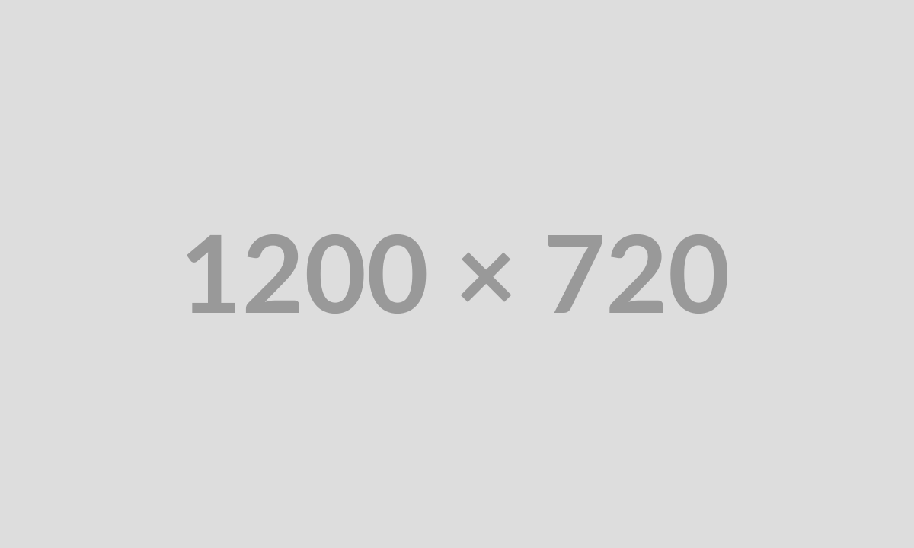
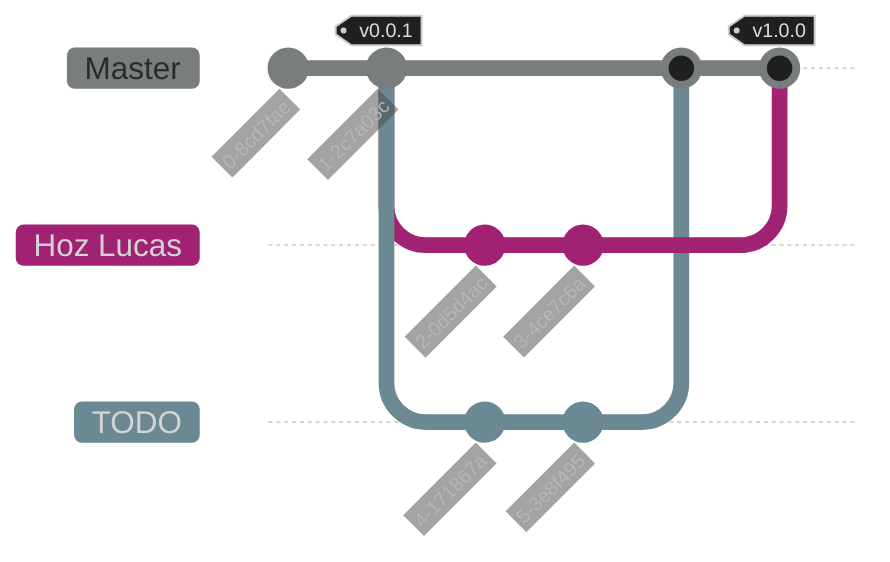

<h1 align="center">
    C Algorithms Practical Work [2025]
</h1>

<p align="center">
    <strong>Repository for the practical work of the Algorithms and Data Structures course - <a href="https://www.unlam.edu.ar/">UNLaM</a> (National University of La Matanza).</strong>
</p>

<p align="center">
    <a href="#----summary">Summary</a> •
    <a href="#----features">Features</a> •
    <a href="#----installation">Installation</a> •
    <a href="#----known-issues">Known issues</a> •
    <a href="#----application-structure">Application structure</a> •
    <br>
    <a href="#----team-workflow">Team workflow</a> •
    <a href="#----development-team">Development team</a> •
    <a href="#----additional-material">Additional material</a> •
    <a href="#----license">License</a> •
    <a href="#----acknowledgments">Acknowledgments</a>
</p>

<p align="center">
    <a href="./docs/translations/es/README.md">[ Spanish version ]</a>
</p>

<p align="center">
    <a href="#"> <!-- TODO -->
         <!-- TODO -->
    </a>
</p>

<p align="center">
    <a href="#" target="_blank">(demonstration video)</a> <!-- TODO -->
</p>

## Summary

This repository contains the practical work for the Algorithms and Data Structures course at the [National University of La Matanza (UNLaM)](https://www.unlam.edu.ar/). The practical work involves [TODO]. <!-- TODO -->

## Features

-   Architecture planning
-   Code conventions and standards
-   Code documentation using [Doxygen](https://www.doxygen.nl/) syntax
-   Commits following the [Conventional Commits](https://www.conventionalcommits.org/en/v1.0.0/)
-   Continuous integration with [GitHub Actions](https://docs.github.com/en/actions)
-   Deployment of releases
-   Team Workflow planning (branches, tags, and releases)
-   TODO <!-- TODO -->

## Installation

1. Clone the repository to your device and install the [CodeBlocks](https://www.codeblocks.org/) IDE with MinGW.

2. Open the files [src.cbp](./src/src.cbp) (main project) and [libs.cbp](./libs/libs.cbp) (library project) with the CodeBlocks application. These files are located within the cloned repository.

3. Select the [libs.cbp](./libs/libs.cbp) project (library project) and compile it in Release mode and Debug mode.

4. Select the [src.cbp](./src/src.cbp) project (main project), run it in Release mode, and enjoy it.

### Known issues

| Issue                                                       | Solution                                                                                                                                                                                                                                                                                                                                                                                                         |
| :---------------------------------------------------------- | :--------------------------------------------------------------------------------------------------------------------------------------------------------------------------------------------------------------------------------------------------------------------------------------------------------------------------------------------------------------------------------------------------------------- |
| **[src.cbp](./src/src.cbp) (main project) doesn't compile** | _Select the [libs.cbp](./libs/libs.cbp) project (library project) and compile it in Release mode and Debug mode. Then, select the [src.cbp](./src/src.cbp) project (main project), right-click on it, choose `Build Options`, and go to the `Linker settings` tab. There, add the `libs.a` files located in the `libs/bin/Debug` and `libs/bin/Release` folders. Finally, try compiling the main project again._ |

## Application structure

```plaintext
C-Algorithms-Practical-Work-2025/
│
├── .github/
│   └── workflows/
│       └── format-code.yml
│
├── docs/
│   ├── statics/
│   │   └── preview.png
│   │
│   └── translations/
│       ├── en/
│       │   ├── documentation.md
│       │   └── requirements.md
│       │
│       └── es/
│           ├── README.md
│           ├── documentation.md
│           └── requirements.md
|
├── libs/
│   ├── libs.cbp
│   ├── macros.h
│   ├── main.h
│   ├── utilities.c
│   └── utilities.h
│
├── src/
│   ├── main.c
│   ├── src.cbp
│   ├── utilities.c
│   └── utilities.h
|
├── .clang-format
├── .gitignore
├── LICENSE
└── README.md
```

-   [.github](./.github) - Files related to continuous integration.

    -   [workflows](./.github/workflows) - GitHub Actions workflows.

-   [docs](./docs) - Files related to the application documentation.

    -   [statics](./docs/statics) - Static files (images, videos, diagrams, etc.).
    -   [translations](./docs/translations) - Translations of `.md` (Markdown) files.

-   [libs](./libs) - Project containing the libraries necessary for the execution of the main application project.

    -   [libs.cbp](./libs/libs.cbp) - Project configuration file.
    -   [macros.h](./libs/macros.h) - File with essential project macros.
    -   [main.h](./libs/main.h) - File indexing all `.h` files of the project.
    -   [utilities.c](./libs/utilities.c) - File with the implementation of the function prototypes found in `utilities.h`.
    -   [utilities.h](./libs/utilities.h) - File with common function prototypes.

-   [src](./src) - Main project of the application.

    -   [main.c](./src/main.c) - Main execution file.
    -   [src.cbp](./src/src.cbp) - Project configuration file.
    -   [utilities.c](./src/utilities.c) - File with the implementation of the function prototypes found in `utilities.h`.
    -   [utilities.h](./src/utilities.h) - File with the function prototypes for configuring the project.

-   [.clang-format](./.clang-format) - Configuration file for the `clang-format` code formatting tool.
-   [.gitignore](./.gitignore) - Git configuration file to avoid tracking unwanted files.
-   [LICENSE](./LICENSE) - Project license.
-   [README.md](./README.md) - Markdown file with the general documentation for the application and repository.

## Team workflow



### Tags

-   `vMAJOR.MINOR.PATCH`: This tag indicates a release of the practical work following [Semantic Versioning](https://semver.org/), and will only be present in the `Master` branch commits.

### Branches

-   `Master`: Branch containing the development versions of the practical work, where team members will introduce new changes (commits).

> The other branches are fictional and represent individual contributions from each member to the `Master` branch.

> [!IMPORTANT]
> Stable versions are only available as [releases](https://github.com/hozlucas28/C-Algorithms-Practical-Work-2025/releases).

## Development team

-   [Hoz Lucas](https://github.com/hozlucas28)
-   [TODO](#) <!-- TODO -->

## Additional material

-   [Code documentation](./docs/translations/en/documentation.md)
-   [Practical work requirements](./docs/translations/en/requirements.md)

## License

This repository is under the [MIT License](../LICENSE). For more information about what is permitted with the contents of this repository, visit [choosealicense.com](https://choosealicense.com/licenses/).

## Acknowledgments

We would like to thank the teachers from the [UNLaM](https://www.unlam.edu.ar/) Algorithms and Data Structures course for their support and guidance.
