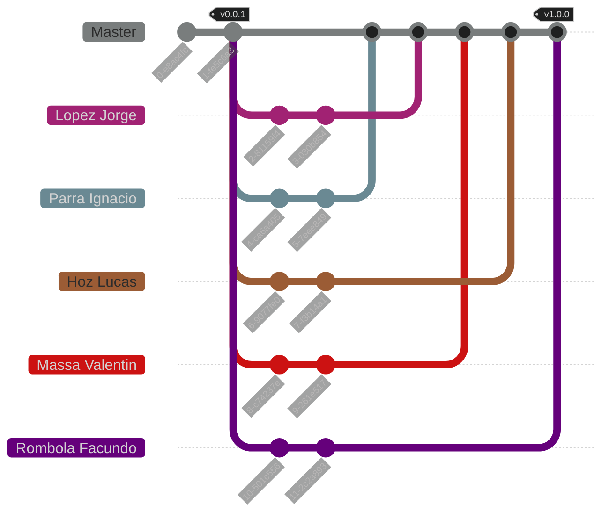

<h1 align="center">
    C Algorithms Practical Work [2025]
</h1>

<p align="center">
    <strong>Repository for the practical work of the Algorithms and Data Structures course</strong>
    <br>
    <strong>- <a href="https://www.unlam.edu.ar/">UNLaM</a> (National University of La Matanza) -</strong>
</p>

<p align="center">
    <a href="#summary">Summary</a> •
    <a href="#features">Features</a> •
    <a href="#installation">Installation</a> •
    <a href="#known-issues">Known issues</a> •
    <a href="#how-to-play">How to play</a>
    <br>
    <a href="#application-structure">Application structure</a> •
    <a href="#team-workflow">Team workflow</a> •
    <a href="#development-team">Development team</a> •
    <a href="#additional-material">Additional material</a>
    <br>
    <a href="#license">License</a> •
    <a href="#acknowledgments">Acknowledgments</a>
</p>

<p align="center">
    <a href="./docs/translations/es/README.md">[ Spanish version ]</a>
</p>

<p align="center">
    
</p>

## Summary

This repository contains the practical work for the Algorithms and Data Structures course at the [National University of La Matanza (UNLaM)](https://www.unlam.edu.ar/). The practical work consists of developing the [Tic-Tac-Toe](https://en.wikipedia.org/wiki/Tic-tac-toe) game using the C programming language. The main objective is to integrate the game with an [API](https://simple.wikipedia.org/wiki/Application_programming_interface) to record the results and thus improve the artificial intelligence.

## Features

-   Architecture planning.
-   Artificial intelligence (AI).
-   Code conventions and standards.
-   Code documentation using [Doxygen](https://www.doxygen.nl/) syntax.
-   Commits following the [Conventional Commits](https://www.conventionalcommits.org/en/v1.0.0/).
-   Communication with [APIs](https://simple.wikipedia.org/wiki/Application_programming_interface) (GET and POST).
-   Continuous integration with [GitHub Actions](https://docs.github.com/en/actions).
-   Deployment of releases.
-   Dynamic memory.
-   Inputs control using validations.
-   local storage of records.
-   Singly linked list implementation.
-   Team Workflow planning (branches, tags, and releases).

## Installation

1. Clone the repository to your device and install the [CodeBlocks](https://www.codeblocks.org/) IDE with MinGW.

2. Open the files [src.cbp](./src/src.cbp) (main project) and [libs.cbp](./libs/libs.cbp) (library project) with the CodeBlocks application. These files are located within the cloned repository.

3. Select the [libs.cbp](./libs/libs.cbp) project (library project) and compile it in Release mode and Debug mode.

4. Select the [src.cbp](./src/src.cbp) project (main project), run it in Release mode, and enjoy it.

> [!TIP]
> If you want, you can use [Visual Studio Code](https://code.visualstudio.com/) to run this project. To do this, simply navigate to [src/main.c](./src/main.c), then click the _C/C++ File_ button at the top right of the [VSCode](https://code.visualstudio.com/) window. The entire application, including libraries and source files, will be compiled, and the application will run automatically inside the integrated terminal.

### Known issues

| Issue                                                       | Solution                                                                                                                                                                                                                                                                                                                                                                                                         |
| :---------------------------------------------------------- | :--------------------------------------------------------------------------------------------------------------------------------------------------------------------------------------------------------------------------------------------------------------------------------------------------------------------------------------------------------------------------------------------------------------- |
| [src.cbp](./src/src.cbp) (main project) doesn't compile | _Select the [libs.cbp](./libs/libs.cbp) project (library project) and compile it in Release mode and Debug mode. Then, select the [src.cbp](./src/src.cbp) project (main project), right-click on it, choose `Build Options`, and go to the `Linker settings` tab. There, add the `libs.a` files located in the `libs/bin/Debug` and `libs/bin/Release` folders. Finally, try compiling the main project again._ |

## How to play

1. Start the game

    When the program starts, a menu with three options will appear.

    - [A] Play Tic-Tac-Toe: Starts a game of [Tic-Tac-Toe](https://en.wikipedia.org/wiki/Tic-tac-toe).
    - [B] Show ranking: Displays the current ranking of the group of players.
    - [C] Exit: Ends the program.

2. Start a match

    - Players are asked to enter their names. Any number of names can be entered.
    - The play order is determined randomly and displayed on the screen.
    - Each player will be asked if they are ready to start.

3. During the match

    - Each player will play a specified number of games, defined in the [configuration file](./src/statics/configuration.txt).
    - In each game, it is randomly assigned whether the player will be `X` or `O`.
    - The 3x3 board will be displayed, and the player must enter the position where they want to place their symbol.
    - The AI makes its move strategically:
        - Blocks the player's victory if possible.
        - Wins if it has the opportunity.
        - Plays randomly if there are no clear moves.
    - The turn alternates between the player and the AI until someone wins or a tie is declared.

4. End of the match
    - Points are assigned for each game as follows:
        - If the player wins, they receive 3 points.
        - If a tie is declared, the player receives 2 points.
        - If the AI wins, the player loses 1 point.
    - Once all games are completed, a report is generated with:
        - Details of the games (including the final state of the board).
        - Winner of each game.
        - Total score of each player.
        - Final result indicating the players with the highest score.
    - The report is saved in a text file with the format `game-report_YYYY-MM-DD-HH-mm.txt`.
    - The results are sent to an [API](https://simple.wikipedia.org/wiki/Application_programming_interface).

### Rules

-   If it's a draw, the player earn two points.
-   If the board is filled without a winner, the result is considered a draw.
-   If the player has the `X` form, he makes the first move else the AI.
-   If the player loses, he loses three points.
-   If the player wins, he earn three points.
-   The AI plays with a random, blocking or winning strategy, predefined at the start of the game.
-   The order of the players is random.
-   The player wins if he places three of his symbols in a horizontal, vertical or diagonal line.

<details>
<summary>How can I change the game configuration?</summary>

To change the configuration, open the file [configuration.txt](./src/statics/configuration.txt).

-   To change the [API](https://simple.wikipedia.org/wiki/Application_programming_interface) base endpoint, replace `https://algoritmos-api.azurewebsites.net/api/TaCTi` with your desired endpoint.
-   To change the team name, replace `TABACO` with your preferred team name.
-   To change the number of games per player, replace `3` with the desired number of games.

> If [configuration.txt](./src/statics/configuration.txt) is missing, the program won't start and will throw an error in the console.

</details>

### Use cases

| N°  | Description                                  | Expected result                                                   | Received result                                                                                                                |
| :-: | :------------------------------------------- | :---------------------------------------------------------------- | :----------------------------------------------------------------------------------------------------------------------------- |
|  1  | Start the game and select `Play Tic-Tac-Toe` | Prompts for player names and starts the game with a random player | Players take turns randomly to play.                                                                                           |
|  2  | Enter player names                           | Entered players are registered correctly                          | Player names are registered and assigned `0` initial points.                                                                   |
|  3  | Play a turn and win against the AI           | The player receives 3 points                                      | 3 points are added to the `points` field of the player structure.                                                              |
|  4  | Play a turn and tie against the AI           | The player receives 2 points                                      | 2 points are added to the `points` field of the player structure.                                                              |
|  5  | Play a turn and lose against the AI          | The player loses 1 point                                          | 1 point is subtracted from the `points` field of the player structure.                                                         |
|  6  | Complete all games and generate a report     | A `.txt` file is generated with the total score                   | A `.txt` file is generated with the game statistics.                                                                           |
|  7  | Check group ranking                          | The group ranking is displayed                                    | The [API](https://simple.wikipedia.org/wiki/Application_programming_interface) is queried, and the group ranking is displayed. |
|  8  | End the game                                 | The program ends without errors                                   | The program ends without errors.                                                                                               |

## Application structure

```plaintext
C-Algorithms-Practical-Work-2025/
│
├── .github/
│   └── workflows/
│       └── format-code.yml
│
├── docs/
│   ├── statics/
│   │   └── preview.png
│   │
│   └── translations/
│       ├── en/
│       │   ├── documentation.md
│       │   └── requirements.md
│       │
│       └── es/
│           ├── README.md
│           ├── documentation.md
│           └── requirements.md
│
├── libs/
│   ├── libs.cbp
│   ├── macros.h
│   ├── main.h
│   ├── utilities.c
│   └── utilities.h
│
├── src/
│   ├── main.c
│   ├── src.cbp
│   ├── utilities.c
│   ├── utilities.h
│   │
│   └── configuration/
│
├── .clang-format
├── .gitignore
├── LICENSE
└── README.md
```

-   [.github](./.github) - Files related to continuous integration.

    -   [workflows](./.github/workflows) - GitHub Actions workflows.

-   [docs](./docs) - Files related to the application documentation.

    -   [statics](./docs/statics) - Static files (images, videos, diagrams, etc.).
    -   [translations](./docs/translations) - Translations of `.md` (Markdown) files.

-   [libs](./libs) - Project containing the libraries necessary for the execution of the main application project.

    -   [libs.cbp](./libs/libs.cbp) - Project configuration file.
    -   [macros.h](./libs/macros.h) - File with essential project macros.
    -   [main.h](./libs/main.h) - File indexing all `.h` files of the project.
    -   [utilities.c](./libs/utilities.c) - File with the implementation of the function prototypes found in `utilities.h`.
    -   [utilities.h](./libs/utilities.h) - File with common function prototypes.

-   [src](./src) - Main project of the application.

    -   [main.c](./src/main.c) - Main execution file.
    -   [src.cbp](./src/src.cbp) - Project configuration file.
    -   [utilities.c](./src/utilities.c) - File with the implementation of the function prototypes found in `utilities.h`.
    -   [utilities.h](./src/utilities.h) - File with the function prototypes for configuring the project.

    -   [configuration](./src/configuration/) - Module with functions, macros, and structures to extract the configuration.

-   [.clang-format](./.clang-format) - Configuration file for the [clang-format](https://clang.llvm.org/docs/ClangFormat.html) code formatting tool.
-   [.gitignore](./.gitignore) - Git configuration file to avoid tracking unwanted files.
-   [LICENSE](./LICENSE) - Project license.
-   [README.md](./README.md) - Markdown file with the general documentation for the application and repository.

## Team workflow



### Tags

-   `vMAJOR.MINOR.PATCH`: This tag indicates a [release](https://github.com/hozlucas28/C-Algorithms-Practical-Work-2025/releases) of the practical work following [Semantic Versioning](https://semver.org/), and will only be present in the `Master` branch commits.

### Branches

-   `Master`: Branch containing the development versions of the practical work, where team members will introduce new changes (commits) through [pull requests](https://github.com/hozlucas28/C-Algorithms-Practical-Work-2025/pulls?q=is%3Apr).

> [!IMPORTANT]
> Stable versions are only available as [releases](https://github.com/hozlucas28/C-Algorithms-Practical-Work-2025/releases).

> [!NOTE]
> The other branches are fictional and represent individual contributions from each member through [pull requests](https://github.com/hozlucas28/C-Algorithms-Practical-Work-2025/pulls?q=is%3Apr) to the `Master` branch.

## Development team

-   [Hoz Lucas](https://github.com/hozlucas28)
-   [Lopez Jorge](https://github.com/jlz10)
-   [Massa Valentin](https://github.com/ValentinMassa)
-   [Parra Ignacio](https://github.com/parradura)

## Additional material

-   [Code documentation](./docs/translations/en/documentation.md)
-   [Practical work requirements](./docs/translations/en/requirements.md)

## License

This repository is under the [MIT License](../LICENSE). For more information about what is permitted with the contents of this repository, visit [choosealicense.com](https://choosealicense.com/licenses/).

## Acknowledgments

We would like to thank the teachers from the [UNLaM](https://www.unlam.edu.ar/) Algorithms and Data Structures course for their support and guidance.
