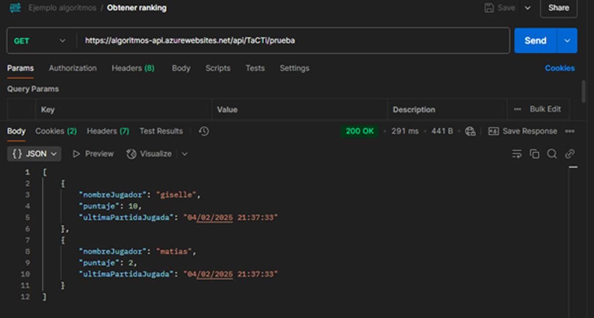
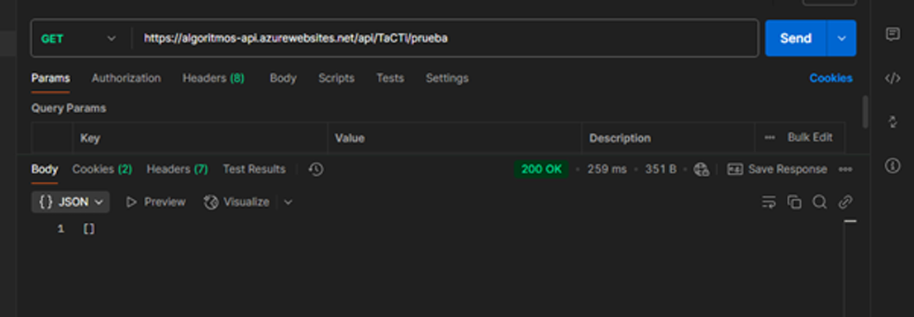
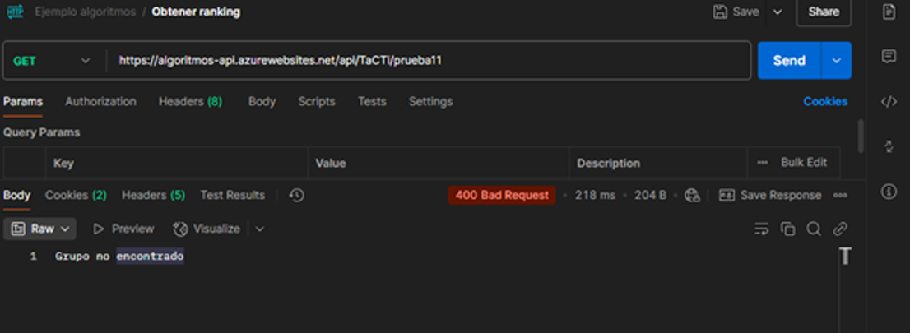
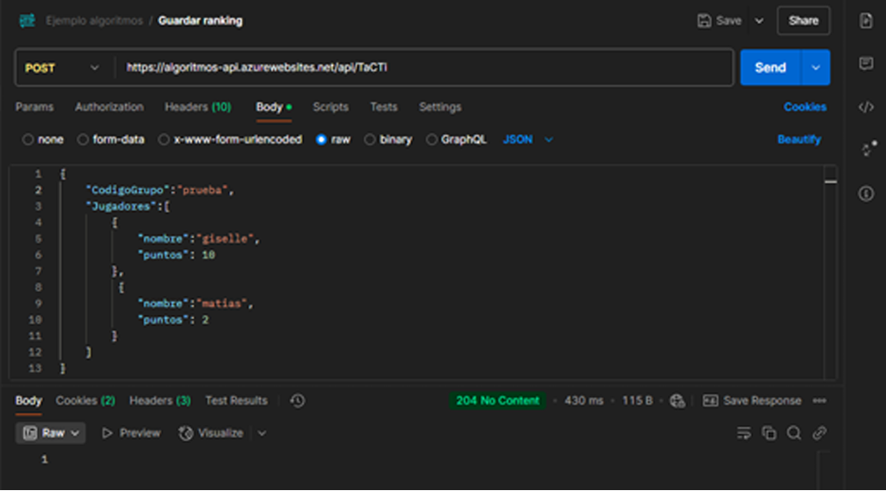
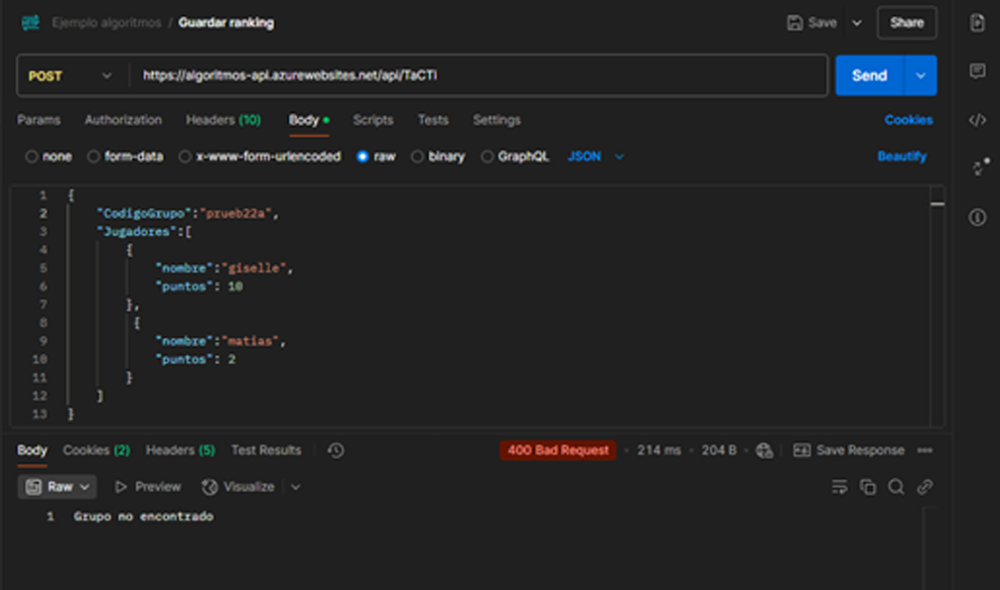
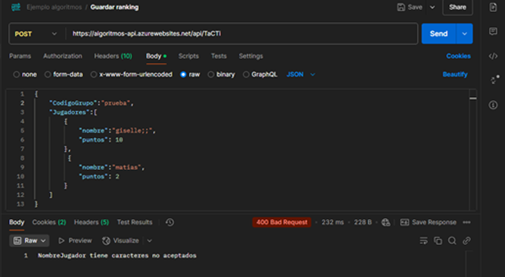
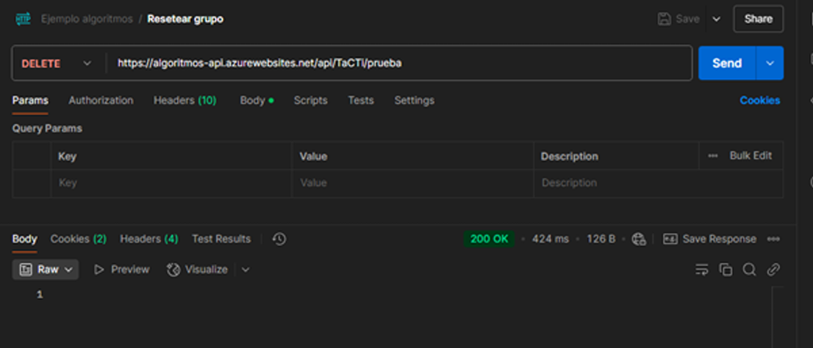

# Practical work - Algorithms and Data Structures

## Submission modality

The submission is done in groups of 4 people.
If all necessary groups are formed and there are still students without a group, they will be assigned by the instructors to pre-formed groups, forming groups of **5 people**.

Groups must be formed and notified via the [MIeL](https://miel.unlam.edu.ar/) forum by 11:59 PM on Tuesday, February 4, 2025, as comments in the following post:


Respecting the group formation deadline is a requirement to pass the practical work.

Each group's name must be a single word and must not be repeated by any other group. The group name must be a word listed in the [RAE dictionary](https://dle.rae.es/).

The group name must consist of letters whose ASCII value is between `0x41` and `0x5A` (inclusive). This implies that spaces, lowercase letters, accents, numbers, etc., are not allowed.

### Examples of names that will be rejected:

| Word       | Reason for Rejection                                        |
| :--------- | :---------------------------------------------------------- |
| LOS PIOJOS | Contains a space (`0x20`).                                  |
| La Renga   | Contains a space and lowercase letters.                     |
| ASDF       | The word `asdf` is not in the dictionary.                   |
| C++        | The ASCII for `+` is `0x2b`, not within the required range. |

### Example of a valid name:

| Word      | Reason for Acceptance                                                                                         |
| :-------- | :------------------------------------------------------------------------------------------------------------ |
| INVISIBLE | It consists of valid characters, and according to the RAE its definition is: _"1. adj. That cannot be seen."_ |

The submission must be a file with the following format: `TP_ALGORITMOS_2024_3C_{GROUP_NAME}.zip`.

In the group submission through [MIeL](https://miel.unlam.edu.ar/), you must attach the `.zip` and the URL to the [GitHub](https://github.com/) repository. The repository must be public.

For example: If the group's name was `INVISIBLE` _-and its members were Spinetta, Pomo, Machi, and Gubitsch-_ the file should be named `TP_ALGORITMOS_2024_3C_INVISIBLE.zip`.

The file format is a reason for rejection of the practical work. As with any system, the requested format must be respected.

### Examples of files that will be considered incorrect:

| File Name                                | Reason for Rejection                  |
| :--------------------------------------- | :------------------------------------ |
| `TP_ALGORITMOS_2024_3c_INVISIBLE.zip`    | Contains a lowercase `c` in the name. |
| `TP_ALGORITMOS_2024_3C_INVISIBLE(1).zip` | Contains `1` in the name.             |
| `TP_ALGORITMOS_2024_2C_INVISIBLE.zip`    | Incorrect semester.                   |
| `TP_ALGORITMOS_2024_3C_INVISIBLE.rar`    | Incorrect file format.                |

The class schedule lists the submission and defense dates for the practical work. The defense is an evaluation instance for the course.

## requirement

A group of developers is creating an interactive kiosk for entertainment in supermarkets. As part of the project, they want to include a [Tic-Tac-Toe](https://en.wikipedia.org/wiki/Tic-tac-toe) minigame where users can play against a basic artificial intelligence. Each game will be recorded on a remote server through an [API](https://simple.wikipedia.org/wiki/Application_programming_interface) to analyze the results and improve the AI in future versions.

The game must be implemented in **C**, allowing users to play individual games against the machine, record the results via an [API](https://simple.wikipedia.org/wiki/Application_programming_interface), and generate a local report with statistics.

## Game rules

At the beginning of each game:

1. Players' names will be entered.
2. The order of players will be randomly determined.

The game rules are as follows:

-   **Alternating Turns:** The user and the machine take turns on a **3x3** board.
-   **Victory Conditions:**
    -   A player wins by placing three of their symbols in a horizontal, vertical, or diagonal line.
    -   If the board fills up without a winner, the game is considered a draw.
-   **Machine Strategy:** The machine will play with a predefined strategy, such as:
    -   Choosing randomly if there is no clear move.
    -   Blocking the player’s victory if possible.
    -   Winning on the next move if it has the opportunity.

## assignment

Implement the [Tic-Tac-Toe](https://en.wikipedia.org/wiki/Tic-tac-toe) game in **C** with the following features:

Upon starting the program, there should be a menu with 3 options:

-   [A] Play.
-   [B] View team ranking.
-   [C] Exit.

If someone chooses `Play`, they will first be asked to enter the names of the players. They can enter as many names as they want.

Once the names are entered, the player order (randomly determined) will be displayed on the screen, and the first player will be asked if they are ready. If they confirm, the game starts.

Each player will play a certain number of games (determined by the configuration file). In each game, they will randomly be assigned either `X` or `O`. The board will be displayed, and the player must enter their move. The machine responds with its move. The process repeats until one of them wins or it’s a draw.

When the player finishes their games, the next player will take their turn, and so on until all games for all players are completed. For each completed game, 3 points will be awarded if the player wins, 2 points for a draw with the machine, and 1 point will be deducted if the player loses.

Once the games are completed, a report will be generated with the details of each game (final board state), the winner, the score for each game, the total score for each player, and the final result, indicating which player(s) obtained the highest score. The file name must contain the current date and time in the following format: `YYYY-MM-DD-HH-mm`. Example file name: `game-report_2024-02-01-12-20.txt`. Additionally, the players' results will be sent to an [API](https://simple.wikipedia.org/wiki/Application_programming_interface) in the following format:

```json
{
    "codigoGrupo": "ASD123",
    "jugadores": [
        {
            "nombre": "Juan",
            "puntos": 10
        }
    ]
}
```

The [API](https://simple.wikipedia.org/wiki/Application_programming_interface) configurations and the number of games per player will be read from a `.txt` file with the following format:

```plaintext
API URL | Group identifier code
Number of games
```

```plaintext
https://api.com | ASD123
3
```

Additionally, the code must be uploaded to a repository on [GitHub](https://github.com/). The repository must include a [README.MD](https://docs.github.com/en/repositories/managing-your-repositorys-settings-and-features/customizing-your-repository/about-readmes) that explains how to play the game and what to do if the game configurations need to be changed.

The repository must also contain a document with different test cases in the following format:

| Description                | Expected Output        | Actual Output              |
| :------------------------- | :--------------------- | :------------------------- |
| Testing what happens if... | It is expected that... | The output obtained was... |

A minimum of 8 test cases must be documented, with screenshots of the obtained output.

## Basic conditions for approval

-   0 errors and 0 warnings.
-   Neat and well-structured code divided into functions.
-   Functions should be as generic as possible.
-   Meaningful variable names.
-   It should work for at least all the documented test cases.

## Endpoint details

This [API](https://simple.wikipedia.org/wiki/Application_programming_interface) allows managing player rankings. The available [Endpoints](https://www.ibm.com/topics/api-endpoint) are: [GET](https://developer.mozilla.org/en-US/docs/Web/HTTP/Methods/GET), [POST](https://developer.mozilla.org/en-US/docs/Web/HTTP/Methods/POST), and [DELETE](https://developer.mozilla.org/en-US/docs/Web/HTTP/Methods/DELETE). Below are their functions, examples, and responses.

### Get rankings (GET)

#### Description

Retrieves the player rankings for the provided group code. If there is no data in the group, it returns an empty array.

#### Endpoint

`GET https://algoritmos-api.azurewebsites.net/api/TaCTi/{GroupCode}`

#### Response

-   200 OK: Returns an array with the group's rankings.
-   400 Bad Request: If the group does not exist or an error occurs.

#### Response example

```json
[
    {
        "nombreJugador": "giselle",
        "puntaje": 10,
        "ultimaPartidaJugada": "04/02/2025 21:37:33"
    },
    {
        "nombreJugador": "matias",
        "puntaje": 2,
        "ultimaPartidaJugada": "04/02/2025 21:37:33"
    }
]
```

_If the group is empty..._

```json
[]
```







### Save rankings (POST)

#### Description

Saves players and their scores in the specified group. If the player's name already exists in the group, it accumulates the score.

#### Endpoint

`POST https://algoritmos-api.azurewebsites.net/api/TaCTi`

#### Request body

```json
{
    "CodigoGrupo": "PRUEBA",
    "Jugadores": [
        {
            "nombre": "giselle",
            "puntos": 10
        },
        {
            "nombre": "matias",
            "puntos": 2
        }
    ]
}
```

#### Response

-   204 No Content: Data was successfully saved.
-   400 Bad Request: If the group does not exist or there is a problem with the provided data.







### Reset group (DELETE)

#### Description

Deletes all rankings from a specific group, fully resetting it. This method should not be implemented in your code; it is only provided to allow you to clear any data you have loaded.

#### Endpoint

`DELETE https://algoritmos-api.azurewebsites.net/api/TaCTi/{GroupCode}`

#### Response

-   200 OK: The group was successfully reset.
-   400 Bad Request: If the group does not exist or an error occurs.


