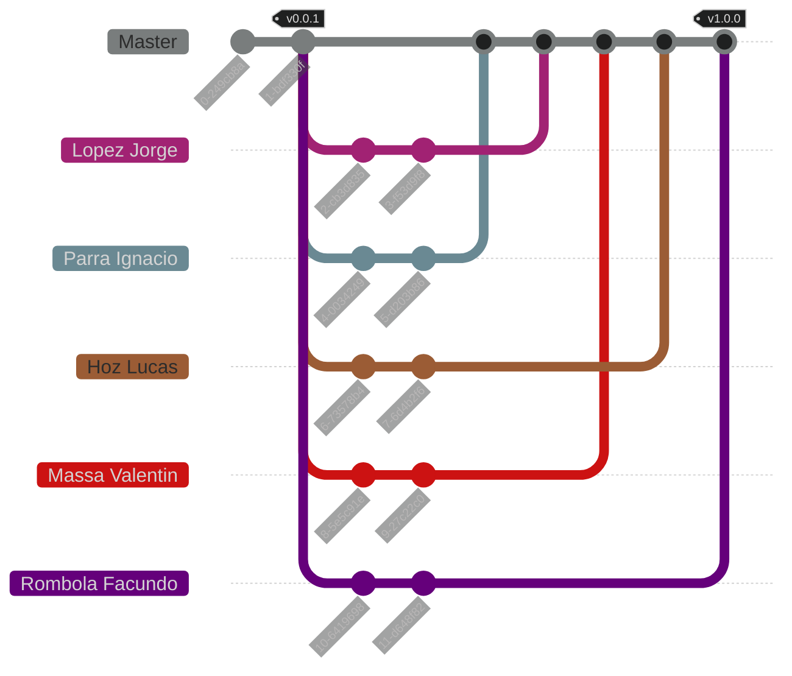

<h1 align="center">
    Trabajo Práctico de Algoritmos y Estructuras de Datos [2025]
</h1>

<p align="center">
    <strong>Repositorio del trabajo práctico para la materia Algoritmos y Estructuras de Datos </strong>
    <br>
    <strong>- <a href="https://www.unlam.edu.ar/">UNLaM</a> (Universidad Nacional de La Matanza) -</strong>
</p>

<p align="center">
    <a href="#resumen">Resumen</a> •
    <a href="#características">Características</a> •
    <a href="#instalación">Instalación</a> •
    <a href="#problemas-conocidos">Problemas conocidos</a> •
    <a href="#Cómo-jugar">Cómo jugar</a>
    <br>
    <a href="#estructura-de-la-aplicación">Estructura de la aplicación</a> •
    <a href="#flujo-de-trabajo-del-equipo">Flujo de trabajo del equipo</a> •
    <a href="#equipo-de-desarrollo">Equipo de desarrollo</a> •
    <a href="#material-adicional">Material adicional</a>
    <br>
    <a href="#licencia">Licencia</a> •
    <a href="#agradecimientos">Agradecimientos</a>
</p>

<p align="center">
    <a href="../../../README.md">[ Versión en inglés ]</a>
</p>

<p align="center">
    
</p>

## Resumen

Este repositorio contiene el trabajo práctico de la materia Algoritmos y Estructuras de Datos de la [Universidad Nacional de La Matanza (UNLaM)](https://www.unlam.edu.ar/). El trabajo práctico consiste en desarrollar el juego [Tateti (Ta-C-Ti)](https://es.wikipedia.org/wiki/Tres_en_l%C3%ADnea) utilizando el lenguaje de programación C. El objetivo principal es integrar el juego con una [API](https://en.wikipedia.org/wiki/API) para registrar los resultados y así mejorar la inteligencia artificial.

## Características

-   Almacenamiento local de registros.
-   Comunicación con APIs (GET y POST).
-   Confirmaciones siguiendo la guía de los [Commits Convencionales](https://www.conventionalcommits.org/es/v1.0.0/).
-   Control de entradas utilizando validaciones.
-   Convenciones y estándares de código.
-   Despliegue de entregables.
-   Documentación del código utilizando la sintaxis de [Doxygen](https://www.doxygen.nl/).
-   Implementación de lista enlazada simple.
-   Integración continua con [GitHub Actions](https://docs.github.com/es/actions).
-   Inteligencia artificial (IA).
-   Memoria dinámica.
-   Planificación de la arquitectura.
-   Planificación del flujo de trabajo del equipo (ramas, etiquetas y versionado).

## Instalación

1. Clona el repositorio en tu dispositivo e instala el IDE [CodeBlocks](https://www.codeblocks.org/) con MinGW.

2. Abre los archivos [src.cbp](../../../src/src.cbp) (proyecto principal) y [libs.cbp](../../../libs/libs.cbp) (proyecto con las librerías) con la aplicación CodeBlocks. Estos archivos se encuentran dentro del repositorio clonado.

3. Selecciona el proyecto [libs.cbp](../../../libs/libs.cbp) (proyecto con las librerías) y compílalo en modo Release y en modo Debug.

4. Selecciona el proyecto [src.cbp](../../../src/src.cbp) (proyecto principal), ejecútalo en modo Release y disfrútalo.

> Más información dentro de la sección [Cómo jugar](#como-jugar).

> [!TIP]
> Si lo deseas, puedes usar [Visual Studio Code](https://code.visualstudio.com/) para ejecutar este proyecto. Para hacerlo, simplemente navega a [src/main.c](./src/main.c), luego haz clic en el botón _C/C++ File_ en la parte superior derecha de la ventana de [VSCode](https://code.visualstudio.com/). Toda la aplicación, incluidas las bibliotecas y archivos fuente, se compilará, y la aplicación se ejecutará automáticamente dentro del terminal integrado.

### Problemas conocidos

| Problema                                                                     | Solución                                                                                                                                                                                                                                                                                                                                                                                                                                                                                                   |
| :--------------------------------------------------------------------------- | :--------------------------------------------------------------------------------------------------------------------------------------------------------------------------------------------------------------------------------------------------------------------------------------------------------------------------------------------------------------------------------------------------------------------------------------------------------------------------------------------------------- |
| **Proyecto [src.cbp](../../../src/src.cbp) (proyecto principal) no compila** | _Selecciona el proyecto [libs.cbp](../../../libs/libs.cbp) (proyecto con las librerías) y compílalo en modo Release y en modo Debug. Luego, selecciona el proyecto [src.cbp](../../../src/src.cbp) (proyecto principal), haz clic derecho sobre este, elige la opción `Build Options` y ve a la pestaña `Linker settings`. Allí, añade los archivos `libs.a` que se encuentran dentro de las carpetas `libs/bin/Debug` y `libs/bin/Release`. Finalmente vuelve a intentar compilar el proyecto principal._ |

## Cómo jugar

TODO. <!-- TODO -->

### Reglas

-   El jugador gana si coloca tres de sus símbolos en una línea horizontal, vertical o diagonal.
-   El orden de los jugadores es aleatorio.
-   La IA juega con una estrategia aleatoria, de bloqueo o ganadora, predefinida al inicio del juego.
-   Si el jugador gana, gana tres puntos.
-   Si el jugador pierde, pierde tres puntos.
-   Si el jugador tiene la forma `X`, él hace el primer movimiento, de lo contrario lo hace la IA.
-   Si el tablero se llena y no hay un ganador, el resultado se considera un empate.
-   Si es un empate, el jugador gana dos puntos.

<details>
<summary>¿Cómo puedo cambiar la configuración del juego?</summary>

Para cambiar la configuración, abre el archivo [configuration.txt](../../../src/statics/configuration.txt).

-   Para cambiar el endpoint base de la API, reemplaza `https://algoritmos-api.azurewebsites.net/api/TaCTi` con el endpoint que desees.
-   Para cambiar el nombre del equipo, reemplaza `TABACO` con el nombre del equipo que prefieras.
-   Para cambiar el número de juegos por jugador, reemplaza `3` con la cantidad de juegos que desees.

> [!IMPORTANTE]
> Si falta el archivo [configuration.txt](../../../src/statics/configuration.txt), el programa no iniciará y mostrará un error en la consola.

</details>

### Casos de uso

<!-- TODO -->

| N°  | Descripción | Resultado esperado | Resultado recibido |
| :-: | :---------- | :----------------- | :----------------- |
|  1  | TODO.       | TODO.              | TODO.              |
|  2  | TODO.       | TODO.              | TODO.              |
|  3  | TODO.       | TODO.              | TODO.              |
|  4  | TODO.       | TODO.              | TODO.              |
|  5  | TODO.       | TODO.              | TODO.              |
|  6  | TODO.       | TODO.              | TODO.              |
|  7  | TODO.       | TODO.              | TODO.              |
|  8  | TODO.       | TODO.              | TODO.              |

## Estructura de la aplicación

```plaintext
C-Algorithms-Practical-Work-2025/
│
├── .github/
│   └── workflows/
│       └── format-code.yml
│
├── docs/
│   ├── statics/
│   │   └── preview.png
│   │
│   └── translations/
│       ├── en/
│       │   ├── documentation.md
│       │   └── requirements.md
│       │
│       └── es/
│           ├── README.md
│           ├── documentation.md
│           └── requirements.md
│
├── libs/
│   ├── libs.cbp
│   ├── macros.h
│   ├── main.h
│   ├── utilities.c
│   └── utilities.h
│
├── src/
│   ├── main.c
│   ├── src.cbp
│   ├── utilities.c
│   ├── utilities.h
│   │
│   └── configuration/
│
├── .clang-format
├── .gitignore
├── LICENSE
└── README.md
```

-   [.github](../../../.github) - Archivos relacionados a la integración continua.

    -   [workflows](../../../.github/workflows) - Flujos de trabajo de las GitHub Actions.

-   [.github](../../../.github) - Archivos relacionados a la documentación de la aplicación.

    -   [statics](../../../.github/statics) - Archivos estáticos (imágenes, videos, diagramas, etc.).
    -   [translations](../../../.github/translations) - Traducciones de los archivos con extensión `.md` (Markdown).

-   [libs](../../../libs) - Proyecto con las librerías necesarias para la ejecución del proyecto principal de aplicación.

    -   [libs.cbp](../../../libs/libs.cbp) - Archivo de configuración del proyecto.
    -   [macros.h](../../../libs/macros.h) - Archivo con las macros esenciales del proyecto.
    -   [main.h](../../../libs/main.h) - Archivo que indexa todos los archivos `.h` del proyecto.
    -   [utilities.c](../../../libs/utilities.c) - Archivo con el desarrollo de los prototipos de función presentes en `utilities.h`.
    -   [utilities.h](../../../libs/utilities.h) - Archivo con los prototipos de función de uso común.

-   [src](../../../src) - Proyecto principal de la aplicación.

    -   [main.c](../../../src/main.c) - Archivo de ejecución principal.
    -   [src.cbp](../../../src/src.cbp) - Archivo de configuración del proyecto.
    -   [utilities.c](../../../src/utilities.c) - Archivo con el desarrollo de los prototipos de función presentes en `utilities.h`.
    -   [utilities.h](../../../src/utilities.h) - Archivo con los prototipos de función para configurar el proyecto.

    -   [configuration](./src/configuration/) - Módulo con las funciones, estructuras y macros para extraer la configuración.

-   [.clang-format](../../../.clang-format) - Archivo de configuración de la herramienta de formateo de código [clang-format](https://clang.llvm.org/docs/ClangFormat.html).
-   [.gitignore](../../../.gitignore) - Archivo de configuración de Git para evitar el rastreo de archivos no deseados.
-   [LICENSE](../../../LICENSE) - Licencia del proyecto.
-   [README.md](../../../README.md) - Archivo Markdown con la documentación general de la aplicación y del repositorio.

## Flujo de trabajo del equipo



### Etiquetas

-   `vMAYOR.MINOR.PATCH`: Esta etiqueta indica la publicación de un Release del trabajo práctico siguiendo el [Semantic Versioning](https://semver.org/), y solo estará presente en las confirmaciones de la rama `Master`.

### Ramas

-   `Master`: Rama que alberga las versiones en desarrollo del trabajo práctico, donde los miembros del equipo incorporarán nuevos cambios (confirmaciones).

> [!IMPORTANT]
> Las versiones estables solo están disponibles como [lanzamientos](https://github.com/hozlucas28/C-Algorithms-Practical-Work-2025/releases).

> [!NOTE]
> Las demás ramas son ficticias y representan las contribuciones individuales que cada miembro hará sobre la rama `Master`.

## Equipo de desarrollo

-   [Hoz Lucas](https://github.com/hozlucas28)
-   [Lopez Jorge](https://github.com/jlz10)
-   [Massa Valentin](https://github.com/ValentinMassa)
-   [Parra Ignacio](https://github.com/parradura)

## Material adicional

-   [Documentación del código](./documentation.md)
-   [Requerimientos del trabajo práctico](./requirements.md)

## Licencia

Este repositorio está bajo la [Licencia MIT](../../../LICENSE). Para más información sobre lo que está permitido hacer con el contenido de este repositorio, visita [choosealicense.com](https://choosealicense.com/licenses/).

## Agradecimientos

Agradecemos a los docentes de la [UNLaM](https://www.unlam.edu.ar/) de la asignatura de Algoritmos y Estructuras de Datos por su apoyo y guía.
