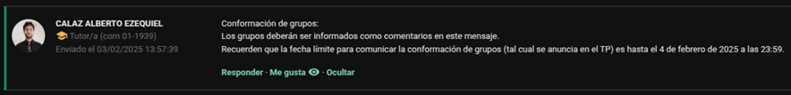

# Trabajo práctico - Algoritmos y Estructuras de Datos

## Modalidad de entrega

La entrega es grupal, en grupos de 4 personas.
En caso de conformarse todos los grupos necesarios y que aún haya estudiantes sin grupo, estos serán asignados por los docentes a grupos previamente armados, formando así grupos de **5 personas**.

Los grupos deben ser formados y notificados vía foro de [MIeL](https://miel.unlam.edu.ar/) hasta las 23:59 del martes 4 de febrero de 2025 como comentarios en la siguiente publicación:



Respetar la fecha de conformación del grupo es condición para aprobar el trabajo práctico.

El nombre de cada grupo debe ser una palabra, y no se puede repetir con otro grupo. El nombre del grupo debe ser una palabra que figure en el [diccionario de la RAE](https://dle.rae.es/).

El nombre del grupo debe estar formado por letras cuyo valor ASCII esté comprendido entre `0x41` y `0x5a` (inclusive). Eso implica que no se admiten espacios, letras en minúscula, tildes, números, etc.

### Ejemplos de nombres que serán rechazados:

| Palabra    | Motivo de rechazo                                          |
| :--------- | :--------------------------------------------------------- |
| LOS PIOJOS | Tiene un espacio (`0x20`).                                 |
| La Renga   | Tiene un espacio y letras en minúsculas.                   |
| ASDF       | La palabra `asdf` no está en el diccionario.               |
| C++        | El ASCII de `+` es `0x2b`, no está en el rango solicitado. |

### Ejemplo de un nombre válido:

| Palabra   | Motivo de aceptación                                                                                       |
| :-------- | :--------------------------------------------------------------------------------------------------------- |
| INVISIBLE | Está formado por caracteres válidos, y según la RAE su definición es: _"1. adj. Que no puede ser visto."_. |

Se deberá entregar un archivo con el siguiente formato: `TP_ALGORITMOS_2024_3C_{NOMBRE_DEl_GRUPO}.zip`.

Por ejemplo: Si el grupo se llamase `INVISIBLE` _-y sus integrantes fueran Spinetta, Pomo, Machi y Gubitsch-_ el archivo debería llamarse `TP_ALGORITMOS_2024_3C_INVISIBLE.zip`.

En la entrega grupal por [MIeL](https://miel.unlam.edu.ar/), se deberá adjuntar el `.zip` `y la URL al repositorio [GitHub](https://github.com/). El repositorio debe ser público.

El formato de entrega es motivo de rechazo del trabajo práctico. Como ocurre con cualquier sistema, debe respetar el formato solicitado.

### Ejemplos de archivos que se considerarán incorrectos:

| Nombre de archivo                        | Motivo de rechazo                        |
| :--------------------------------------- | :--------------------------------------- |
| `TP_ALGORITMOS_2024_3c_INVISIBLE.zip`    | Contiene una `c` minúscula en el nombre. |
| `TP_ALGORITMOS_2024_3C_INVISIBLE(1).zip` | Contiene `1` en su nombre.               |
| `TP_ALGORITMOS_2024_2C_INVISIBLE.zip`    | Cuatrimestre incorrecto.                 |
| `TP_ALGORITMOS_2024_3C_INVISIBLE.rar`    | Formato de archivo incorrecto.           |

En el cronograma de clases figuran las fechas de entrega y defensa del trabajo práctico. La defensa del trabajo práctico, es una instancia de evaluación de la materia.

## Necesidad

Un grupo de desarrolladores está creando un tótem interactivo para entretenimiento en supermercados. Como parte del proyecto, quieren incluir un minijuego de [Tateti (Ta-C-ti)](https://es.wikipedia.org/wiki/Tres_en_l%C3%ADnea) en el que los usuarios puedan jugar contra una inteligencia artificial básica. Cada partida se registrará en un servidor remoto mediante una [API](https://en.wikipedia.org/wiki/API) para analizar los resultados y mejorar la IA en futuras versiones.

Se requiere implementar el juego en **C**, permitiendo a los usuarios jugar partidas individuales contra la máquina, registrar los resultados en una [API](https://en.wikipedia.org/wiki/API) y generar un informe local con estadísticas.

## Reglas del juego

Al inicio de cada juego, se va a:

1.  Ingresar los nombres de los jugadores.
2.  Sortear aleatoriamente el orden de los jugadores.

Las reglas del juego son las siguientes:

-   **Turnos alternados**: El usuario y la máquina juegan por turnos en un tablero de **3x3**.
-   **Condiciones de victoria**:
    -   Un jugador gana si coloca tres de sus símbolos en una línea horizontal, vertical o diagonal.
    -   Si el tablero se llena sin que haya un ganador, la partida se considera un empate.
-   **Estrategia de la máquina**: La máquina jugará con una estrategia predefinida, como:
    -   Elegir aleatoriamente si no hay una jugada clara.
    -   Bloquear la victoria del jugador si es posible.
    -   Ganar en la siguiente jugada si tiene la oportunidad.

## Consigna

Implementar el juego [Tateti](https://es.wikipedia.org/wiki/Tres_en_l%C3%ADnea) en **C** con las siguientes características:

Apenas se inicie el programa, deberá haber un menú de 3 opciones:

-   [A] Jugar.
-   [B] Ver ranking del equipo.
-   [C] Salir.

Si alguien ingresa a `Jugar`, primero se le pedirá que cargue los nombres de las personas que van a jugar. Puede ingresar la cantidad de nombres que desee.

Una vez que termine de ingresarlos, aparecerá por pantalla el orden en el que jugarán los jugadores (recordar que se determina aleatoriamente), y se le preguntará al primer jugador si está listo. En caso de que sí, inicia el juego.

Cada jugador va a jugar una cierta cantidad de partidas (determinada por el archivo de configuración). En cada partida, le tocará aleatoriamente ser la `X` o el `O`. Se mostrará el tablero y el jugador tiene que ingresar donde quiere hacer su movimiento. La máquina responde con su jugada. Se repite el proceso hasta que uno de los dos gane o se empate.

Cuando el jugador termine con sus partidas, pasará al siguiente jugador. Y así sucesivamente hasta terminar todas las partidas de todos los jugadores. Por cada partida que se termine, se sumaran 3 puntos si gana el jugador, 2 puntos si empata con la maquina o se restara 1 punto si el jugador pierde.

Una vez finalizadas las partidas, se generará un informe con el detalle de las partidas (como quedó el tablero al final), quien ganó, el puntaje de cada una, el puntaje total por jugador y el resultado final, qué jugador/es obtuvieron mayor puntaje. El nombre del archivo debe contener la fecha y la hora actual en el siguiente formato: `YYYY-MM-DD-HH-mm`. Ejemplo de nombre: `informe-juego_2024-02-01-12-20.txt`. Además, se enviará a una [API](https://en.wikipedia.org/wiki/API) el resultado de los jugadores con el siguiente formato:

```json
{
    "codigoGrupo": "ASD123",
    "jugadores": [
        {
            "nombre": "Juan",
            "puntos": 10
        }
    ]
}
```

Las configuraciones de la [API](https://en.wikipedia.org/wiki/API) y la cantidad de partidas por jugador se leerá de un archivo `.txt` con el siguiente formato:

```plaintext
URL de la API | Código identificador del grupo
Cantidad de partidas
```

```plaintext
https://api.com | ASD123
3
```

Por otro lado, deberán subir el código a un repositorio en [GitHub](https://github.com/). Agregándole a su repositorio un [README.MD](https://docs.github.com/es/repositories/managing-your-repositorys-settings-and-features/customizing-your-repository/about-readmes) que indique cómo jugar el juego y qué hacer si quiero cambiar las configuraciones del juego.

A ese repositorio se deberá subir un documento con diferentes lotes de prueba con el siguiente formato:

| Descripción                                  | Salida esperada  | Salida obtenida           |
| :------------------------------------------- | :--------------- | :------------------------ |
| Se quiere probar qué es lo que pasaría si... | Se espera que... | La salida obtenida fue... |

Mínimo se deben documentar 8 casos de prueba, con captura de pantalla de la salida obtenida.

## Condiciones básicas para aprobar

-   0 errores y 0 warnings
-   Código prolijo y dividido en funciones
-   Funciones lo más genéricas posibles
-   Nombres significativos de variables
-   Que funcione mínimo para todos los casos de prueba que se presentan

## Detalle de los Endpoints

Esta [API](https://en.wikipedia.org/wiki/API) permite gestionar rankings de jugadores. Los [Endpoints](https://www.ibm.com/es-es/topics/api-endpoint) disponibles son: [GET](https://developer.mozilla.org/es/docs/Web/HTTP/Methods/GET), [POST](https://developer.mozilla.org/es/docs/Web/HTTP/Methods/POST) y [DELETE](https://developer.mozilla.org/es/docs/Web/HTTP/Methods/DELETE). A continuación, se detallan sus funciones, ejemplos y respuestas.

### Obtener rankings (GET)

#### Descripción

Obtiene los rankings de jugadores para el código de grupo enviado. Si no hay datos en el grupo, devuelve un array vacío.

#### Endpoint

`GET https://algoritmos-api.azurewebsites.net/api/TaCTi/{CodigoGrupo}`

#### Respuesta

-   200 OK: Devuelve un array con los rankings del grupo.
-   400 Bad Request: Si el grupo no existe o ocurre un error.

#### Ejemplo de respuesta

```json
[
    {
        "nombreJugador": "giselle",
        "puntaje": 10,
        "ultimaPartidaJugada": "04/02/2025 21:37:33"
    },
    {
        "nombreJugador": "matias",
        "puntaje": 2,
        "ultimaPartidaJugada": "04/02/2025 21:37:33"
    }
]
```

_Si el grupo está vacío..._

```json
[]
```


### Guardar rankings (POST)

#### Descripción

Guarda jugadores y sus puntajes en el grupo especificado. Si el nombre del jugador ya existe en el grupo, acumula el puntaje.

#### Endpoint

`POST https://algoritmos-api.azurewebsites.net/api/TaCTi`

#### Cuerpo de la solicitud

```json
{
    "CodigoGrupo": "PRUEBA",
    "Jugadores": [
        {
            "nombre": "giselle",
            "puntos": 10
        },
        {
            "nombre": "matias",
            "puntos": 2
        }
    ]
}
```

#### Respuesta

-   204 No Content: Los datos fueron guardados correctamente.
-   400 Bad Request: Si el grupo no existe o hay algún problema con los datos enviados.


### Resetear grupo (DELETE)

#### Descripción

Elimina todos los rankings de un grupo específico, reseteándolo completamente. Este método no debe estar implementado en su código, es solamente para que puedan limpiar los datos que hayan cargado.

#### Endpoint

`DELETE https://algoritmos-api.azurewebsites.net/api/TaCTi/{CodigoGrupo}`

#### Respuesta

-   200 OK: El grupo fue reseteado correctamente.
-   400 Bad Request: Si el grupo no existe o ocurre un error.


